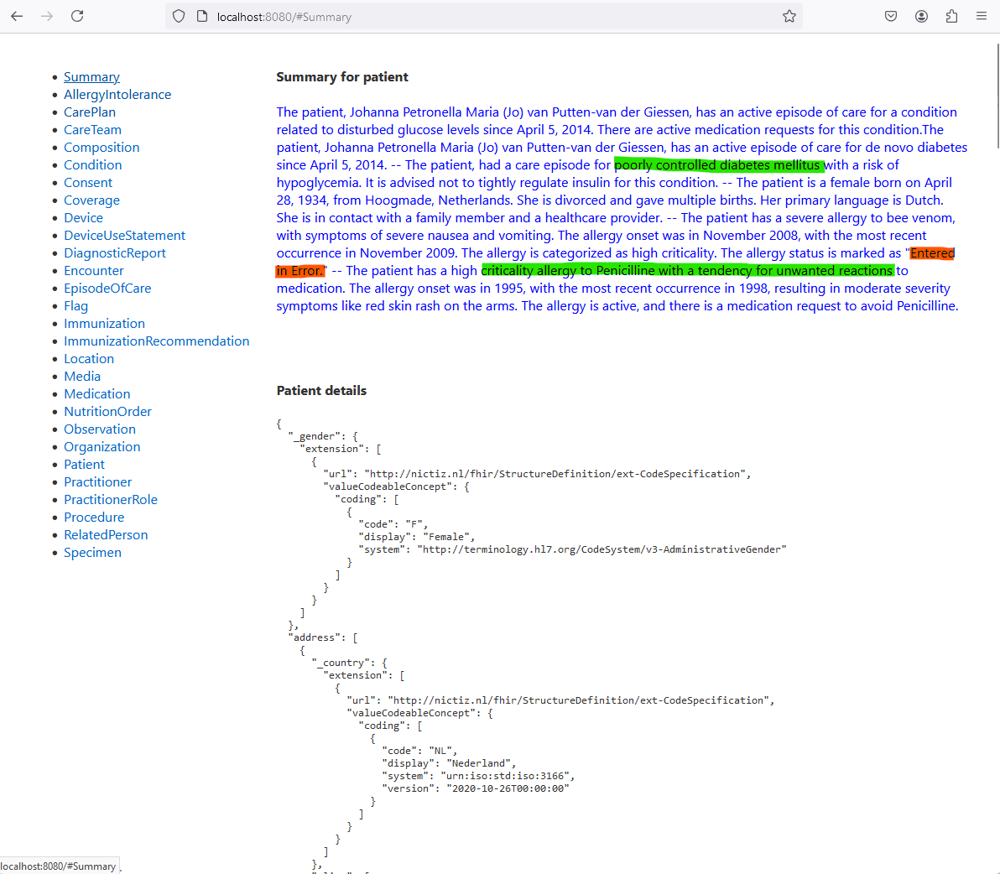

Simple proof of concept enrichting FHIR bundles of medical data with prompt generated summary. Demo.

#### Backend
Mini FHIR server with completions. Serves resources from database folder to request with browser, curl, frontend, etc.
```bash
  cd src
  go run serve.go ../database
  wget -O - http://localhost/fhir/Patient/nl-core-Patient-01?_summary=true&_include=AllergyIntolerance,EpisodeOfCare


  Starting FHIR server on localhost:80. Database: ../database
  [7.71s]  Request for /fhir/Patient/nl-core-Patient-01 returned 4 resources with summary.
  [1.59ms] Request for /fhir/Patient/nl-core-Patient-01 returned 1 resources.
  [8.25ms] Request for /fhir/Patient returned 8 resources without summary.
```

#### Frontend
Mini Svelte frontend, viewing the resources fetched, including summary.
```bash
cd src/frontend
npm i
npm run dev
```
Open `http://localhost:8080` in browser:



#### Output
Example FHIR bundle, with generated summary as custom resource:
```json
{
  "resourceType": "Bundle",
  "entry": [
    {
      "resource": {
        "id": "nl-core-Patient-01",
        "resourceType": "Patient",
        "birthDate": "1934-04-28",
        "deceasedBoolean": false,
        ...
      }
    },
    {
      "resource": {
        "id": "nl-core-EpisodeOfCare-01",
        "resourceType": "EpisodeOfCare",
        "diagnosis": [
          {
            "condition": {
              "display": "Problem, type: Klinische bevinding",
              "reference": "Condition/nl-core-EpisodeOfCare-01-Condition-01",
              "type": "Condition"
            }
          }
        ],
        ...
    },
    {
      "resource": {
        "id": "nl-core-AllergyIntolerance-02",
        "resourceType": "AllergyIntolerance",
        "criticality": "high",
        "lastOccurrence": "1998-06-02",
        "onsetDateTime": "1995-01-01",
        "reaction": [ ... ],
      }
    },
    {
      "resource": {
        "author": "GPT",
        "date": "2024-09-01",
        "resourceType": "Summary",
        "subject": "Patient/nl-core-Patient-01",
        "text": "The patient has an active episode of care for poorly controlled diabetes mellitus with a risk of hypoglycemia. It is advised not to tightly regulate insulin."
      }
    },
  ]
}
```

